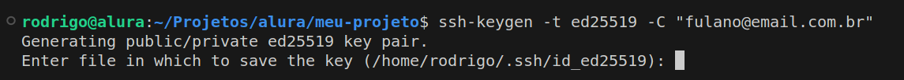
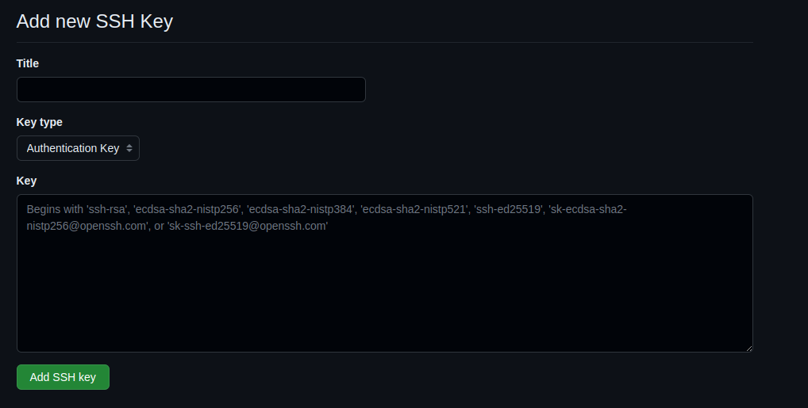

# Chave SSH

Ao vincular um repositório remoto ao nosso repositório local, via comando `git remote add`, precisamos utilizar algum protocolo seguro, como HTTPS ou SSH. No caso de se utilizar o protocolo SSH, escolha realizada neste curso, devemos gerar uma chave SSH em nosso computador, além de cadastrá-la em nossa conta do GitHub. Isso é necessário para garantir a autenticação, pois o GitHub checa se quem está realizando o push dos commits tem permissão para realizar tal ação.

## **Geração de uma chave SSH**

Antes de executar o comando `git push`, precisamos gerar uma chave SSH. A geração da chave é feita via terminal, com o comando `ssh-keygen -t ed25519 -C "SEU EMAIL AQUI"`:



Repare, na imagem anterior, que ao executar o comando para gerar uma chave SSH, uma pergunta foi feita e o terminal fica travado esperando nossa resposta:

```powershell

Generatingpublic/private ed25519key pair.
Enter filein whichto save thekey (/home/rodrigo/.ssh/id_ed25519):

```

Essa primeira pergunta é para indicarmos o **diretório** em nosso computador no qual a chave será salva, sendo que entre parênteses é indicado o diretório padrão. O recomendado é apenas apertar a tecla `enter` no teclado para que a chave seja salva no diretório padrão, pois assim o Git consegue encontrar essa chave automaticamente sempre que executarmos o comando `git push`.

Após apertar a tecla `enter`, uma nova pergunta será apresentada no terminal:

```bash

Enterpassphrase (enterfor no passphrase):

```

Essa segunda pergunta é para indicarmos se desejamos adicionar uma senha à chave SSH que será gerada. Caso você digite uma senha, toda vez que executar o comando `git push` será necessário digitar tal senha. Ao não digitar nada e apenas apertar a tecla `enter`, a chave será gerada sem a proteção de uma senha.

Por fim, a terceira e última pergunta é apenas para confirmar a senha anterior:

```bash
Enter same passphrase again

```

A chave será gerada e a seguinte mensagem será exibida no terminal:

```bash

Your identification has been savedin /home/rodrigo/.ssh/id_ed25519
Yourpublickey has been savedin /home/rodrigo/.ssh/id_ed25519.pub
Thekey fingerprint is:
SHA256:jxAkhGR7NHm/0fcmyPnErZxSKr+ObsH7r4AC/vUNvPY fulano@email.com.br
Thekey's randomart image is:
+--[ED25519 256]--+
| .oo=..          |
| ..o.+.          |
|  . .... .       |
|   .   .o . .    |
|  .   ..S+ = o   |
| . .   ++o+ = +  |
|  . . o =o.* =   |
|   . o .=*o =    |
|    .  +=*E=.    |
+----[SHA256]-----+

```

Na primeira linha da mensagem você consegue identificar o diretório no seu computador no qual a chave foi salva. Agora, basta acessar tal diretório para ter acesso à chave SSH.

> Observação: Nesse diretório serão gerados dois arquivos que representam a chave SSH, sendo um para a chave privada (arquivo id_ed25519) e o outro para a chave pública (id_ed25519.pub).
> 

## Cadastrando a chave SSH no GitHub

Após gerar a chave, precisamos cadastrá-la em nossa conta do GitHub, para que assim o GitHub consiga nos identificar e autenticar ao executar o comando `git push` de nosso computador.

Acesse a [página de chaves SSH](https://github.com/settings/keys) de sua conta no GitHub e clique no botão **New SSH key** ou **Nova chave SSH** para realizar o cadastro da chave:



Repare que o formulário exibido na imagem anterior contém três campos:

- **Title** ou **Título**: Informe um apelido para sua chave SSH (por exemplo: computador casa)
- **Key type** ou **Tipo de chave**: Escolha o tipo **Authentication Key** ou **Chave de autenticação**
- **Key** ou **Chave**: Nesse campo você deve colar o **conteúdo** do arquivo da sua chave SSH **pública** (arquivo id_ed25519.pub)

Após realizar esse procedimento, será possível sincronizar o repositório local com o remoto, enviando os novos commits com o comando `git push`.
